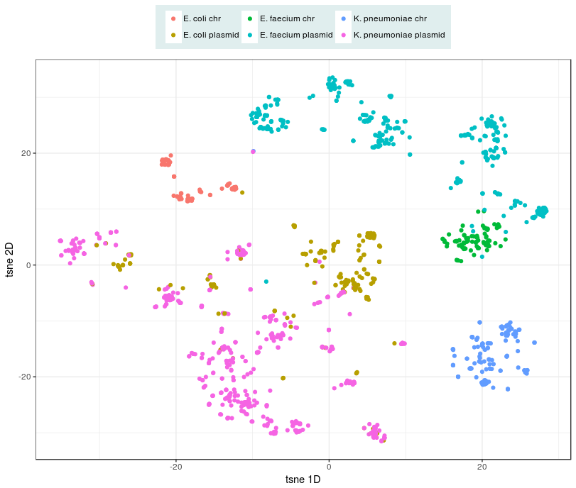
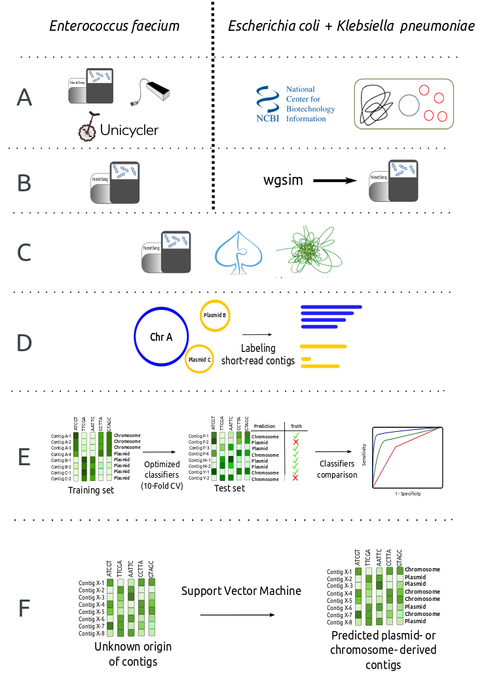
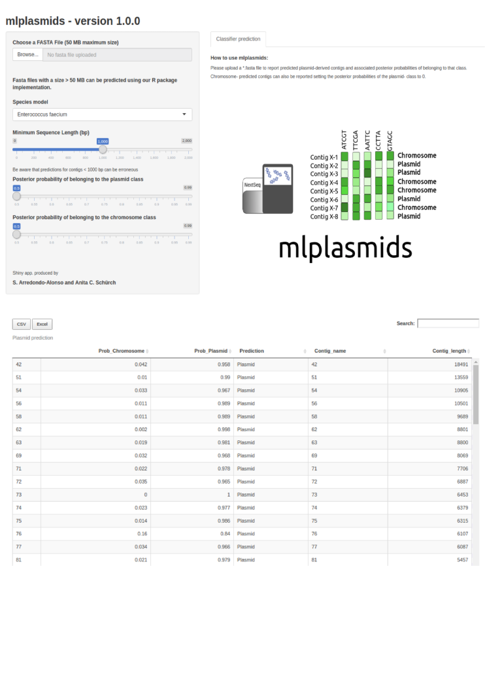

mlplasmids is an R package to predict if assembled short-read contigs from *E. coli*, *K. pneunomiae* or *E. faecium* originated 
from a plasmid or a chromosome. The full description of mlplasmids is available at [bioRxiv]() soon.

# FAQ

## Why does it work?

The k-mer profiles of plasmids are different from the k-mer profiles of chromosomes of bacteria. 
While k-mer profiles of plasmids can be very diverse, the diversity observed in k-mer profiles of chromosomal sequences of a single 
species are usually limited, and can be used to differentiate species.


Computed mash distances between chromosome and plasmid sequences were clustered using t-sne. 

## How does it work?

For each species, we trained machine-learning classifiers with contigs of known origin (plasmid or chromosome).




## How does it compare to other plasmid prediction methods?

Favorably. However, we do not recommend its usage on metagenomes or other species that the ones currently included.

## How can I use it?

#### For single genomes
Use the [webserver](https://sarredondo.shinyapps.io/mlplasmids)




#### For larger batches of genomes

Install and load the R package
```
install.packages("devtools")
devtools::install_git("https://gitlab.com/sirarredondo/mlplasmids")
library(mlplasmids)
```
Load the fasta file containing the sequences into R

``` r
# Change the following object with the system location of your input file
my_path <- ('~/Data/E_faecium_plasmids/E745_control/E745_spades_contigs.fasta')
example_prediction <- plasmid_classification(path_input_file = my_path, species = 'Enterococcus faecium')
```

The value returned by the function is a dataframe that reports predicted plasmid-derived contigs.

``` r
head(example_prediction)
```

    ##    Prob_Chromosome Prob_Plasmid Prediction
    ## 36     0.042683241    0.9573168    Plasmid
    ## 41     0.006876928    0.9931231    Plasmid
    ## 43     0.085699794    0.9143002    Plasmid
    ## 46     0.034722838    0.9652772    Plasmid
    ## 55     0.013318272    0.9866817    Plasmid
    ## 63     0.012378171    0.9876218    Plasmid
    ##                                Contig_name Contig_length
    ## 36  NODE_36_length_22926_cov_74.4686_ID_71         22926
    ## 41  NODE_41_length_19157_cov_27.6651_ID_81         19157
    ## 43  NODE_43_length_18357_cov_78.2779_ID_85         18357
    ## 46  NODE_46_length_16769_cov_25.6735_ID_91         16769
    ## 55 NODE_55_length_14069_cov_23.9568_ID_109         14069


## Can we include other species in mlplasmids?

Yes! All the [code](https://gitlab.com/sirarredondo/analysis_mlplasmids) that was used to train the models is available to generate ML classifiers for other species.
We highly welcome pull requests to include additional species models into the package.
